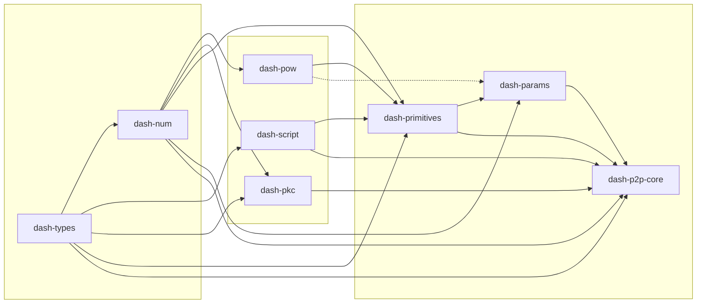

> [!WARNING]
>
> This SDK is in early stages of development and different crates may have different levels of conformance and
> testing rigour. The completeness of one crate does not imply the completeness of others.
>
> As with any alternate implementation, unintended deviations from the reference implementation (i.e.
> [Dash Core](https://github.com/dashpay/dash)) are possible and must be accounted for as a risk when building on
> this SDK. If requirements demand strict conformance guarantees, it is recommended to interface with Dash Core
> through [RPC](https://docs.dash.org/en/stable/docs/core/api/remote-procedure-calls.html),
> [REST](https://docs.dash.org/en/stable/docs/core/api/http-rest.html) or
> [ZMQ](https://docs.dash.org/en/stable/docs/core/api/zmq.html) instead.

`base-sdk` is a parsing and stateless verification SDK for Dash's layer 1 blockchain.

## Crates

| Crate | Description | CI (`develop`) | Coverage |
|-------|-------------|--------------|----------|
| [dash-num](./pkgs/num) | Hash blobs, 256-bit arithmetic, compact target encoding |  |  |
| [dash-p2p-core](./pkgs/p2p_core) | P2P message types and wire format |  |  |
| [dash-params](./pkgs/params) | Chain parameters for `mainnet`, `testnet3`, and `regtest` |  |  |
| [dash-pkc](./pkgs/pkc) | BLS (legacy + IETF) and secp256k1 operations |  |  |
| [dash-pow](./pkgs/pow) | Proof of work scheme |  |  |
| [dash-primitives](./pkgs/primitives) | Blocks, transactions, payloads, governance objects |  |  |
| [dash-script](./pkgs/script) | Script opcodes, classification, and address derivation |  |  |
| [dash-types](./pkgs/types) | Shared byte and integer newtypes, serde helpers |  |  |

## Dependencies

> [!NOTE]
> Solid lines are build dependencies. Dotted lines are test dependencies.

## Features

All crates support these standard features:

| Feature | Description | Crates |
|---------|-------------|--------|
| _(baseline)_ | `no_std` + `alloc`, always available | _All_ |
| `std` | Enable standard library support | _All_ |
| `serde` | Enable serde serialization (where applicable) | [num](./pkgs/num), [p2p-core](./pkgs/p2p_core), [pkc](./pkgs/pkc), [primitives](./pkgs/primitives), [script](./pkgs/script), [types](./pkgs/types) |
| `full` | Enables all non-conflicting features | _All_ |
| `_internal` | Access to package internals, reserved for testing and benchmarks. **Not part of API contract.** | _All_ |

Specific crates define additional features:

| Feature | Description | Crates |
|---------|-------------|--------|
| `k256` | Enable secp256k1 support | [pkc](./pkgs/pkc) |
| `bls` | Enable standard and legacy BLS support | [pkc](./pkgs/pkc) |
| `aes_hw` | Enable hardware-accelerated AES on supported platforms | [pow](./pkgs/pow) |
| `simd` | Use SIMD backends (requires nightly) | [pow](./pkgs/pow) |

## License

Copyright &copy; 2026-present, The Dash Core developers. See the accompanying file [LICENSE](./LICENSE) or
<!-- pyml disable-next-line no-bare-urls -->
https://opensource.org/license/MIT
